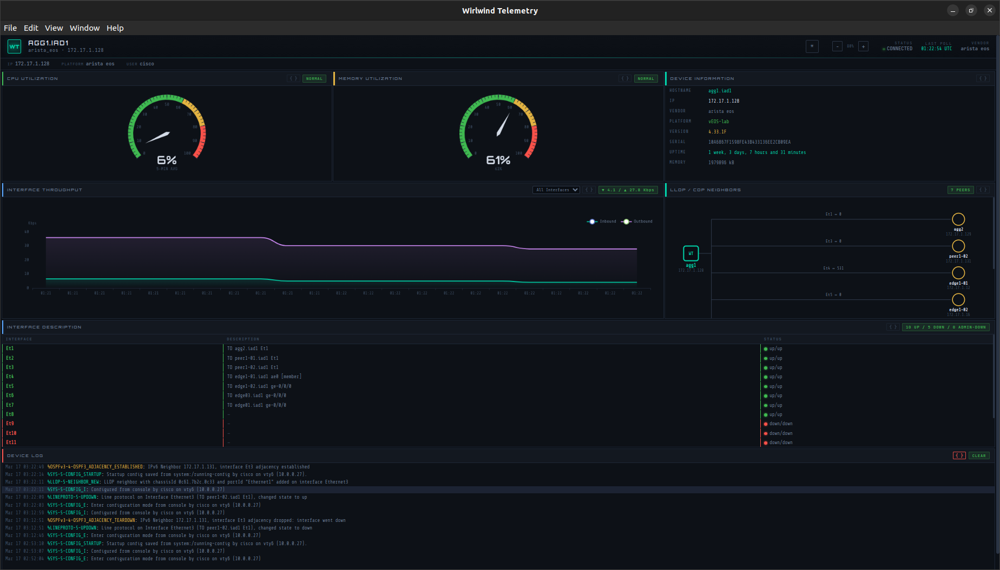

# Wirlwind Telemetry

Real-time network device monitoring over SSH. Connect to a switch or router, poll it on a configurable interval, parse the output, and push live telemetry to an interactive dashboard — all from a single Electron app. No Python, no venv, just a native installable application for Linux, Mac or Windows.



## What It Does

Wirlwind connects to a network device via SSH invoke-shell, runs CLI commands on a timed loop, structures the output through a TextFSM/regex parser chain, normalizes the results through vendor-specific drivers, and streams everything to an ECharts dashboard over Electron IPC.

One command to go from zero to live telemetry:

```bash
npm run dev -- --connect 172.17.1.128 cisco cisco123 arista_eos
```

Or launch via environment variables (for integration with nterm-js or other tools):

```bash
WT_HOST=172.16.1.5 WT_USER=cisco WT_PASS=cisco123 WT_VENDOR=cisco_ios npm run dev
```

The dashboard populates within the first poll cycle — CPU, memory, interface throughput, LLDP neighbors, interface status table, and device logs with syslog severity highlighting.

### Dashboard Panels

| Panel | Data Source | What It Shows |
|---|---|---|
| CPU Utilization | `show processes cpu sorted` (IOS) / `show processes top once` (EOS) | Gauge + 5-min average, top 20 process list |
| Memory Utilization | `show processes memory sorted` (IOS) / `show processes top once` (EOS) | Gauge + used/total/free breakdown |
| Interface Throughput | `show interfaces` | Per-interface in/out bps chart, auto-scales bps → Kbps → Mbps → Gbps |
| LLDP/CDP Neighbors | `show lldp neighbors detail` | Topology graph with hostnames, management IPs, interface labels |
| Interface Description | `show interfaces description` | Status table with up/down/admin-down counts and descriptions |
| Device Log | `show logging` (IOS) / `show logging last 24 hours` (EOS) | Syslog entries color-coded by severity (emergency → debug) |
| Device Information | `show version` + connection metadata | Hostname, IP, vendor, platform, version, serial, uptime, image |

### Vendor Support

| Vendor | Driver | Live Tested | Notes |
|---|---|---|---|
| Arista EOS | `arista_eos` | ✅ Full dashboard | Linux `top` CPU format, LLDP neighbors |
| Cisco IOS | `cisco_ios` | ✅ Full dashboard | `show processes cpu sorted`, CDP/LLDP, tested on 7206VXR + IOSv |
| Cisco IOS-XE | `cisco_ios_xe` | ✅ Shares IOS driver | Same CLI format, same templates |
| Cisco NX-OS | `cisco_nxos` | — | Extends IOS driver, `show system resources` for memory |
| Juniper JunOS | `juniper_junos` | ✅ Full dashboard | `show chassis routing-engine`, LLDP |

Adding a vendor: extend `BaseDriver`, override `postProcess`, call `registerDriver()`. The collection YAMLs and TextFSM templates handle the rest.

## Quick Start

```bash
# Install dependencies
npm install

# Connect to a device and start polling (CLI args)
npm run dev -- --connect <host> <user> <pass> <vendor>

# Examples
npm run dev -- --connect 10.0.0.1 admin secret arista_eos
npm run dev -- --connect 10.0.0.1 admin secret cisco_ios --legacy   # old ciphers
npm run dev -- --connect 10.0.0.1 admin secret juniper_junos --port 830

# Connect via environment variables (for nterm-js integration)
WT_HOST=10.0.0.1 WT_USER=admin WT_PASS=secret WT_VENDOR=cisco_ios npm run dev
WT_HOST=10.0.0.1 WT_USER=admin WT_PASS=secret WT_VENDOR=cisco_ios WT_LEGACY=1 npm run dev

# Launch without auto-connect (demo mode)
npm run dev
```

### Environment Variables

| Variable | Required | Default | Description |
|---|---|---|---|
| `WT_HOST` | Yes | — | Device hostname or IP |
| `WT_USER` | Yes | — | SSH username |
| `WT_PASS` | Yes | — | SSH password |
| `WT_VENDOR` | Yes | — | Vendor type (see vendor table) |
| `WT_PORT` | No | `22` | SSH port |
| `WT_LEGACY` | No | `false` | Set to `1` or `true` for legacy cipher mode |

CLI args take precedence over environment variables. Environment variables are used when `--connect` is absent.

### Build & Package

```bash
npm run build                    # TypeScript compile only
npm run build:linux              # AppImage + deb
npm run build:win                # NSIS installer
npm run build:mac                # DMG
```

### Tests

```bash
# Offline parser tests (32 tests — ANSI filter, regex, TextFSM, YAML loading)
npx tsc && node dist/tests/test-parse.js

# Live SSH test against a real device
npx tsc && node dist/tests/test-ssh.js <host> <user> <pass> [--debug]
```

## Architecture

Wirlwind is a monorepo with three interconnected subsystems:

| Subsystem | What | Where |
|---|---|---|
| **wirlwindssh** | SSH automation library (invoke-shell, prompt detection, pagination disable) | `src/wirlwindssh/` |
| **tfsmjs** | TextFSM parser for JavaScript (port of Google's Python TextFSM) | `src/tfsmjs/` |
| **wirlwind** | Electron app — poll engine, parser chain, drivers, dashboard | `src/wirlwind/` |

### Data Pipeline

Every poll cycle runs this pipeline for each collection:

```
Device CLI
    │
    ▼
executeCommand()          SSH invoke-shell, wait for prompt
    │
    ▼
scrubOutput()             Strip command echo (top) and prompt (bottom)
    │
    ▼
parseWithTrace()          TextFSM → regex → passthrough (priority chain)
    │
    ▼
shapeOutput()             entries[] → flat dict (cpu) or { interfaces: [] }
    │
    ▼
lowercaseKeys()           GLOBAL_CPU_PERCENT_IDLE → global_cpu_percent_idle
    │
    ▼
applyNormalize()          YAML field renames: neighbor_name → device_id
    │
    ▼
driver.postProcess()      Vendor-specific: parseRateToBps, normalizeCpu, etc.
    │
    ▼
stateStore.update()       In-memory state + ring buffers → IPC → dashboard
```

### Process Architecture

```
┌──────────────────────────────────────────────────────────────┐
│  Renderer Process                                            │
│  ┌────────────────────────────────────────────────────────┐  │
│  │  index.html — ECharts dashboard                        │  │
│  │  Gauges, charts, topology graph, log viewer            │  │
│  └────────────────────┬───────────────────────────────────┘  │
│                       │ window.wirlwind (contextBridge)       │
│  ┌────────────────────┴───────────────────────────────────┐  │
│  │  preload.ts — IPC API                                  │  │
│  └────────────────────┬───────────────────────────────────┘  │
├───────────────────────┼──────────────────────────────────────┤
│  Main Process         │ ipcMain ↔ webContents                │
│  ┌────────────────────┴───────────────────────────────────┐  │
│  │  bridge.ts — TelemetryBridge                           │  │
│  └──┬─────────────────────────┬───────────────────────────┘  │
│     │                         │                               │
│  ┌──┴──────────────┐  ┌──────┴────────────────────────┐     │
│  │  stateStore.ts  │  │  pollEngine.ts                │     │
│  │  In-memory      │  │  scrubOutput → parse → shape  │     │
│  │  Ring buffers   │  │  → normalize → postProcess    │     │
│  └─────────────────┘  └──────┬──────────┬─────────────┘     │
│                              │          │                     │
│  ┌───────────────────────────┴┐  ┌─────┴──────────────────┐ │
│  │  parserChain.ts            │  │  drivers/              │ │
│  │  TextFSM → regex → pass   │  │  base.ts + logParsers  │ │
│  │  Uses tfsmjs               │  │  arista_eos.ts         │ │
│  └────────────────────────────┘  │  cisco_ios.ts          │ │
│                                  │  cisco_nxos.ts         │ │
│  ┌────────────────────────────┐  │  juniper_junos.ts      │ │
│  │  collectionLoader.ts      │  └────────────────────────┘ │
│  │  YAML → normalizedDef     │                               │
│  └────────────────────────────┘                               │
│  ┌────────────────────────────────────────────────────────┐  │
│  │  wirlwindssh — WhirlwindSSHClient                      │  │
│  │  ssh2 invoke-shell, prompt detection, legacy ciphers   │  │
│  └────────────────────────────────────────────────────────┘  │
└──────────────────────────────────────────────────────────────┘
```

## Collection System

Collections define what to poll, how to parse, and how to normalize. Each collection is a YAML file per vendor stored in `collections/<name>/<vendor>.yaml`. The Python YAML format is auto-normalized to the TypeScript interface at load time — same files work in both projects.

```yaml
# collections/cpu/cisco_ios.yaml
command: "show processes cpu sorted"
interval: 30

parsers:
  - type: textfsm
    templates:
      - cisco_ios_show_processes_cpu.textfsm
  - type: regex
    pattern: 'CPU utilization for five seconds:\s+(\d+)%/(\d+)%;\s+one minute:\s+(\d+)%;\s+five minutes:\s+(\d+)%'
    flags: DOTALL
    groups:
      five_sec_total: 1
      five_sec_interrupt: 2
      one_min: 3
      five_min: 4

normalize:
  five_sec_total: cpu_5_sec
  five_sec_interrupt: cpu_5_sec_interrupt
```

The parser chain tries each parser in priority order. If TextFSM fails, it falls back to regex. If regex fails, raw output passes through. The `normalize` map renames vendor-specific field names to the canonical names drivers and the dashboard expect.

### Built-in Collections

| Collection | Command (Cisco IOS) | Command (Arista EOS) | Parser | Interval |
|---|---|---|---|---|
| `cpu` | `show processes cpu sorted` | `show processes top once` | TextFSM + regex | 30s |
| `memory` | `show processes memory sorted` | `show processes top once` | TextFSM + regex | 30s |
| `interfaces` | `show interfaces description` | `show interfaces description` | TextFSM | 60s |
| `interface_detail` | `show interfaces` | `show interfaces` | TextFSM | 60s |
| `neighbors` | `show lldp neighbors detail` | `show lldp neighbors detail` | TextFSM | 300s |
| `bgp_summary` | `show ip bgp summary` | `show ip bgp summary` | TextFSM | 120s |
| `log` | `show logging` | `show logging last 24 hours` | Driver (raw) | 30s |
| `device_info` | `show version` | `show version` | TextFSM | 300s |

## Workspace Overlay

When a vendor ships a new OS version that changes CLI output, you can override any template or collection without modifying the project.

```bash
# Create workspace
mkdir -p ~/.wirlwind/workspace/templates/textfsm
mkdir -p ~/.wirlwind/workspace/collections

# Override a broken template
cp templates/textfsm/cisco_ios_show_interfaces.textfsm \
   ~/.wirlwind/workspace/templates/textfsm/
vi ~/.wirlwind/workspace/templates/textfsm/cisco_ios_show_interfaces.textfsm

# Restart — workspace version loads instead of built-in
npm run dev -- --connect 172.16.1.2 cisco cisco123 cisco_ios
```

Resolution order: **workspace first → built-in fallback**. Only include files you want to override.

The log confirms overrides:

```
Workspace (default): /home/user/.wirlwind/workspace
Workspace overrides: 1 templates, 0 collections
[workspace] template: cisco_ios_show_interfaces.textfsm
```

Custom workspace path via `~/.wirlwind/config.json`:

```json
{ "workspace": "/home/user/my-wirlwind-workspace" }
```

## Driver System

Drivers handle vendor-specific post-processing. Each driver extends `BaseDriver` and overrides `postProcess()` to normalize fields into the canonical format the dashboard expects.

```
drivers/
├── base.ts              # BaseDriver, registry, shared transforms
├── logParsers.ts        # Vendor-specific syslog parsers
├── arista_eos.ts        # Arista EOS
├── cisco_ios.ts         # Cisco IOS/IOS-XE (registered for both)
├── cisco_nxos.ts        # Cisco NX-OS (extends CiscoIOSDriver)
└── juniper_junos.ts     # Juniper JunOS
```

### What Drivers Do

| Transform | Example |
|---|---|
| CPU normalization | Arista `idle_pct: 94` → `five_sec_total: 6`; Cisco reads `cpu_5_sec` directly |
| Memory calculation | IOS `processor_total` - `processor_free` → `used_pct: 14.5`; NX-OS KB → bytes conversion |
| Rate conversion | `"23.5 kbps"` → `input_rate_bps: 23500` |
| Neighbor normalization | `neighbor_name` → `device_id`, FQDN stripping, platform extraction, serial cleanup |
| Interface abbreviation | `GigabitEthernet0/1` → `Gi0/1`, `Port-Channel1` → `Po1` |
| Log parsing | Raw syslog → `{ timestamp, facility, severity, mnemonic, message }` |
| BGP state normalization | `state_pfx: "42"` → `state: "Established", prefixes_rcvd: 42` |

### Adding a Vendor

```typescript
// drivers/my_vendor.ts
import { BaseDriver, registerDriver } from './base';

export class MyVendorDriver extends BaseDriver {
  postConnectCommands = ['set cli screen-length 0'];

  postProcess(collection, data) {
    if (collection === 'cpu') {
      // vendor-specific CPU normalization
    }
    return data;
  }
}

registerDriver('my_vendor', MyVendorDriver);
```

Then import it in `drivers/index.ts`:

```typescript
import './my_vendor';
```

## Project Structure

```
wirlwind-js/
├── package.json
├── tsconfig.json
├── src/
│   ├── tfsmjs/
│   │   └── tfsm-node.js              # TextFSM parser (JS port)
│   ├── wirlwindssh/                   # SSH automation library (MIT)
│   │   ├── index.ts                   # Barrel exports
│   │   ├── client.ts                  # WhirlwindSSHClient
│   │   ├── types.ts                   # Config interfaces + defaults
│   │   ├── filters.ts                 # ANSI filter + pagination commands
│   │   ├── legacy.ts                  # Legacy/modern cipher sets
│   │   ├── logger.ts                  # Abstract logger
│   │   └── emulation.ts              # NetEmulate transparent redirect
│   ├── wirlwind/
│   │   ├── main/
│   │   │   ├── main.ts                # Electron entry + CLI/env arg parsing
│   │   │   ├── preload.ts             # contextBridge IPC API
│   │   │   ├── bridge.ts              # TelemetryBridge
│   │   │   ├── pollEngine.ts          # Poll loop + pipeline orchestration
│   │   │   ├── parserChain.ts         # TextFSM → regex → passthrough
│   │   │   ├── scrubOutput.ts         # Command echo + prompt stripping
│   │   │   ├── applyNormalize.ts      # YAML field rename maps
│   │   │   ├── stateStore.ts          # In-memory state + history rings
│   │   │   ├── collectionLoader.ts    # YAML loader + Python format normalizer
│   │   │   ├── workspace.ts           # Workspace overlay resolution
│   │   │   └── drivers/
│   │   │       ├── index.ts           # Barrel + registration side-effects
│   │   │       ├── base.ts            # BaseDriver, registry, shared transforms
│   │   │       ├── logParsers.ts      # Vendor-specific syslog parsers
│   │   │       ├── arista_eos.ts      # Arista EOS driver
│   │   │       ├── cisco_ios.ts       # Cisco IOS/IOS-XE driver
│   │   │       ├── cisco_nxos.ts      # Cisco NX-OS driver
│   │   │       └── juniper_junos.ts   # Juniper JunOS driver
│   │   ├── renderer/
│   │   │   └── index.html             # ECharts dashboard
│   │   └── shared/
│   │       └── types.ts               # Shared types, IPC channels
│   └── tests/
│       ├── test-parse.ts              # Offline: 32 parser tests
│       ├── test-ssh.ts                # Live: SSH connect/command
│       └── test-pipeline.ts           # Live: full pipeline test
├── collections/                       # 8 collections × 4 vendors (YAML)
├── templates/textfsm/                 # 21 TextFSM templates
└── tools/
    └── tfsm-tester.html               # Standalone TextFSM template tester
```

## IPC Protocol

**Renderer → Main** (invoke/handle):

| Channel | Payload | Returns |
|---|---|---|
| `wt:connect` | `DeviceTarget` | `{ success, error? }` |
| `wt:disconnect` | — | `{ success }` |
| `wt:start-polling` / `wt:stop-polling` | — | `{ success }` |
| `wt:get-snapshot` | — | `TelemetryState` |
| `wt:get-history` | `'cpu' \| 'memory'` | `HistoryEntry[]` |

**Main → Renderer** (send/on):

| Channel | Payload |
|---|---|
| `wt:state-changed` | `{ collection, data }` |
| `wt:cycle-complete` | `{ cycle, elapsed }` |
| `wt:connection-status` | `'connected' \| 'disconnected' \| 'error'` |
| `wt:device-info` | `DeviceInfo` |

## Tools

### tfsm-tester

Standalone browser-based TextFSM template tester. Paste a template and device output, hit Parse, see results as a table or JSON. The full tfsmjs engine is embedded — no dependencies, no server, just open the HTML file.

Located at `tools/tfsm-tester.html`.

## Python Lineage

This is a TypeScript port of the PyQt6-based Wirlwind Telemetry. The data flow, collection format, TextFSM templates, and dashboard layout are carried over directly.

| Python | TypeScript |
|---|---|
| paramiko invoke-shell | ssh2 invoke-shell (wirlwindssh) |
| QWebChannel + QObject signals | contextBridge + ipcMain/ipcRenderer |
| TextFSM (ntc-templates) | tfsmjs (tfsm-node.js) |
| PyQt6 QWebEngineView | Electron BrowserWindow |
| `yaml.safe_load` | js-yaml + `normalizeCollectionDef()` |
| `state_store.py` (dict + signals) | `stateStore.ts` (EventEmitter) |
| `poll_engine.py` | `pollEngine.ts` (async/await) |
| `parser_chain.py` | `parserChain.ts` |
| `bridge.py` (slots/signals) | `bridge.ts` (IPC handle/send) |
| `drivers/__init__.py` | `drivers/base.ts` |
| `drivers/arista_eos.py` | `drivers/arista_eos.ts` |
| `drivers/cisco_ios.py` | `drivers/cisco_ios.ts` + `cisco_nxos.ts` |

## Version Alignment

Versions are pinned to match the nterm-js project for shared Electron/ssh2 compatibility:

```
electron:          ^33.0.0
ssh2:              ^1.16.0
electron-log:      ^5.0.0
better-sqlite3:    ^12.8.0
js-yaml:           ^4.1.0
typescript:        ^5.4.0
electron-builder:  ^25.0.0
```

## License

GPL-3.0 (Electron app). The wirlwindssh SSH library is MIT licensed separately.