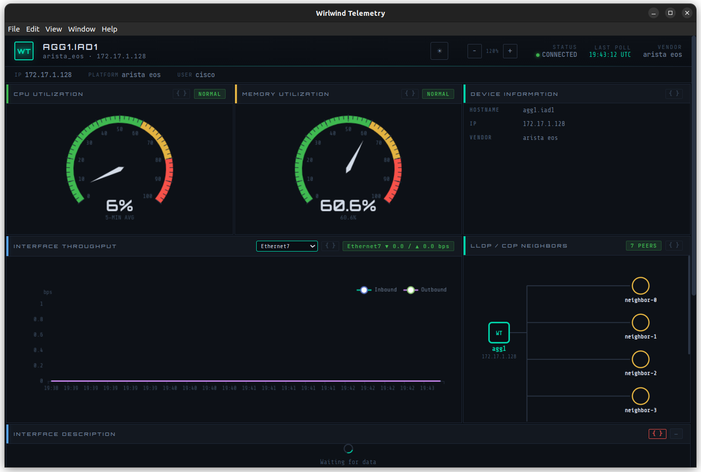

# Wirlwind-JS

Electron/TypeScript port of Wirlwind Telemetry — real-time network device monitoring with SSH polling, structured parsing, and a live dashboard. Ported from the PyQt6 original with architectural parity across three interconnected subsystems.

## What This Is

Wirlwind-JS connects to a network device over SSH, polls it on a configurable interval, parses the output through TextFSM or regex, normalizes the results through vendor-specific drivers, and pushes live telemetry to an ECharts dashboard. It monitors CPU, memory, interfaces, LLDP/CDP neighbors, BGP summary, and device logs across Cisco IOS/IOS-XE/NX-OS, Arista EOS, and Juniper Junos.

The Python original (`wirlwind_telemetry/`) runs on PyQt6 with QWebChannel bridging the poll engine to a QWebEngineView dashboard. This port replaces PyQt6 with Electron, QWebChannel with `contextBridge` + IPC, and paramiko with `ssh2` — but the data flow, collection format, TextFSM templates, and dashboard HTML are carried over directly.



## Quick Start

```bash
npm install
npm run dev -- --connect 172.17.1.128 cisco cisco123 arista_eos
```

This compiles TypeScript, launches the Electron dashboard, auto-connects to the device via SSH, and starts polling. CPU gauge, memory gauge, LLDP neighbor map, interface throughput chart, and device info populate within the first poll cycle.

Other forms:
```bash
# With legacy ciphers for old gear
npm run dev -- --connect 10.0.0.1 admin pass cisco_ios --legacy

# Custom SSH port
npm run dev -- --connect 10.0.0.1 admin pass juniper_junos --port 830

# No auto-connect — dashboard launches in demo mode
npm run dev
```

## Architecture

```
┌─────────────────────────────────────────────────────────────────┐
│  Renderer Process (BrowserWindow)                               │
│  ┌───────────────────────────────────────────────────────────┐  │
│  │  index.html — ECharts dashboard                           │  │
│  │  CPU/Memory gauges, Interface throughput, LLDP neighbors  │  │
│  │  Interface table, Device log, Device info panel           │  │
│  └──────────────────────┬────────────────────────────────────┘  │
│                         │ window.wirlwind (contextBridge)        │
│  ┌──────────────────────┴────────────────────────────────────┐  │
│  │  preload.ts — IPC API exposed to renderer                 │  │
│  └──────────────────────┬────────────────────────────────────┘  │
├─────────────────────────┼───────────────────────────────────────┤
│  Main Process           │ ipcMain.handle / webContents.send     │
│  ┌──────────────────────┴────────────────────────────────────┐  │
│  │  bridge.ts — TelemetryBridge                              │  │
│  │  + connectToDevice() for CLI auto-connect                 │  │
│  └───┬──────────────────────────────┬────────────────────────┘  │
│      │                              │                            │
│  ┌───┴───────────────┐  ┌──────────┴─────────────────────┐     │
│  │  stateStore.ts    │  │  pollEngine.ts                  │     │
│  │  In-memory store  │  │  SSH → parse → shape →          │     │
│  │  CPU/mem history  │  │  lowercase → postProcess →      │     │
│  │  Ring buffers     │  │  state update                   │     │
│  └───────────────────┘  └──────┬──────────┬───────────────┘     │
│                                │          │                      │
│  ┌─────────────────────────────┴──┐  ┌───┴────────────────────┐ │
│  │  parserChain.ts                │  │  drivers/              │ │
│  │  TextFSM → regex → passthrough │  │  base.ts (shared)     │ │
│  │  Uses tfsmjs                   │  │  arista_eos.ts        │ │
│  └────────────────────────────────┘  │  juniper_junos.ts     │ │
│                                      │  cisco_ios.ts         │ │
│  ┌──────────────────────────────┐    └────────────────────────┘ │
│  │  collectionLoader.ts        │                                │
│  │  Python YAML auto-normalize │                                │
│  └──────────────────────────────┘                                │
│  ┌──────────────────────────────────────────────────────────┐   │
│  │  wirlwindssh — WhirlwindSSHClient                        │   │
│  │  Invoke-shell SSH automation (ssh2)                      │   │
│  └──────────────────────────────────────────────────────────┘   │
└─────────────────────────────────────────────────────────────────┘
```

### Data Pipeline Per Poll Cycle

```
SSH Device ◄── pollEngine.executeCommand()
    │
    └── raw output
         │
    parserChain.parseWithTrace()
         ├── TextFSM (tfsmjs)      → { entries: [{...}, ...] }
         ├── Regex (named groups)  → { field: value, ... }
         └── Passthrough           → { _raw: "..." }
         │
    shapeOutput()                  → cpu: flat dict, interfaces: { interfaces: [...] }
         │
    lowercaseKeys()                → GLOBAL_CPU_PERCENT_IDLE → global_cpu_percent_idle
         │
    driver.postProcess()           → normalizeCpu, normalizeMemory, postProcessNeighbors, etc.
         │
    stateStore.updateCollection()  → emits 'stateChanged'
         │
    bridge → IPC                   → webContents.send('wt:state-changed')
         │
    dashboard                      → updateCPU(), updateMemory(), updateNeighbors(), etc.
```

### Python → TypeScript Mapping

```
Python (wirlwind_telemetry)           TypeScript (wirlwind-js)
──────────────────────────            ─────────────────────────
paramiko invoke-shell              →  ssh2 invoke-shell (wirlwindssh)
QWebChannel + QObject signals      →  contextBridge + ipcMain/ipcRenderer
TextFSM (Python ntc-templates)     →  tfsmjs (tfsm-node.js)
PyQt6 QWebEngineView              →  Electron BrowserWindow
yaml.safe_load                     →  js-yaml + normalizeCollectionDef()
state_store.py (dict + signals)    →  stateStore.ts (EventEmitter)
poll_engine.py                     →  pollEngine.ts (async/await + shapeOutput)
parser_chain.py                    →  parserChain.ts (textfsm → regex chain)
bridge.py (QObject slots/signals)  →  bridge.ts (ipcMain.handle → webContents.send)
drivers/__init__.py                →  drivers/base.ts (shared transforms)
drivers/arista_eos.py              →  drivers/arista_eos.ts
drivers/juniper_junos.py           →  drivers/juniper_junos.ts
dashboard/index.html               →  renderer/index.html
```

## Project Structure

```
wirlwind-js/
├── package.json
├── tsconfig.json
├── src/
│   ├── tfsmjs/
│   │   └── tfsm-node.js           # TextFSM parser (JS port)
│   ├── wirlwindssh/                # SSH automation library (standalone, MIT)
│   │   ├── index.ts                # Barrel exports
│   │   ├── client.ts               # WhirlwindSSHClient
│   │   ├── types.ts, types-ssh.ts  # Config interfaces + defaults
│   │   ├── filters.ts              # ANSI filter + pagination commands
│   │   ├── legacy.ts               # Legacy/modern cipher sets
│   │   ├── logger.ts               # Abstract logger
│   │   └── emulation.ts            # NetEmulate redirect
│   ├── wirlwind/
│   │   ├── main/
│   │   │   ├── main.ts             # Electron entry + CLI arg parsing
│   │   │   ├── preload.ts          # contextBridge API
│   │   │   ├── bridge.ts           # TelemetryBridge + connectToDevice()
│   │   │   ├── pollEngine.ts       # SSH poll loop + shape + lowercase
│   │   │   ├── parserChain.ts      # TextFSM → regex → passthrough
│   │   │   ├── stateStore.ts       # In-memory state + history rings
│   │   │   ├── collectionLoader.ts # YAML loader + Python format normalizer
│   │   │   └── drivers/
│   │   │       ├── index.ts        # Barrel + registration side-effects
│   │   │       ├── base.ts         # BaseDriver, registry, shared transforms
│   │   │       ├── arista_eos.ts   # Full Arista EOS driver
│   │   │       ├── juniper_junos.ts # Full Juniper JunOS driver
│   │   │       └── cisco_ios.ts    # Cisco IOS/IOS-XE/NX-OS driver
│   │   ├── renderer/
│   │   │   └── index.html          # ECharts dashboard
│   │   └── shared/
│   │       └── types.ts            # Shared types, IPC channels
│   └── tests/
│       ├── test-parse.ts           # Offline: 32 parser tests
│       ├── test-ssh.ts             # Live: SSH connect/command test
│       └── test-pipeline.ts        # Live: full pipeline test
├── collections/                    # 7 collections × 4 vendors (Python YAML format)
└── templates/textfsm/              # 13 TextFSM templates
```

## Vendor Support

| Vendor | Driver | Collections | Templates | Live Tested |
|---|---|---|---|---|
| Cisco IOS | `cisco_ios` | 7 | 1 | — |
| Cisco IOS-XE | `cisco_ios_xe` | 7 | 1 | — |
| Cisco NX-OS | `cisco_nxos` | — | — | — |
| Arista EOS | `arista_eos` | 7 | 3 | ✅ Dashboard verified |
| Juniper Junos | `juniper_junos` | 7 | 13 | — |

## Build & Run

```bash
npm install
npm run dev                          # Launch dashboard (demo mode)
npm run dev -- --connect HOST U P V  # Auto-connect to device
npm run build                        # TypeScript compile only
npm run build:linux                  # Package as AppImage + deb
npm run build:win                    # Package as NSIS installer
npm run build:mac                    # Package as DMG
```

### Tests

```bash
npx tsc && node dist/tests/test-parse.js                          # 32 offline tests
npx tsc && node dist/tests/test-ssh.js HOST USER PASS [--debug]   # SSH connection test
```

## IPC Protocol

**Renderer → Main** (invoke/handle):

| Channel | Payload | Returns |
|---|---|---|
| `wt:connect` | `DeviceTarget` | `{ success, error? }` |
| `wt:disconnect` | — | `{ success }` |
| `wt:start-polling` / `wt:stop-polling` | — | `{ success }` |
| `wt:get-snapshot` | — | `TelemetryState` (JSON) |
| `wt:get-history` | `'cpu' \| 'memory'` | `HistoryEntry[]` (JSON) |

**Main → Renderer** (send/on):

| Channel | Payload |
|---|---|
| `wt:state-changed` | `{ collection, data }` |
| `wt:cycle-complete` | `{ cycle, elapsed }` |
| `wt:connection-status` | `'connected' \| 'disconnected' \| 'error'` |
| `wt:device-info` | `DeviceInfo` |

## Collection YAML Format

Collections use the Python format directly — the `collectionLoader` auto-normalizes to the TS interface:

```yaml
command: "show processes top once"
interval: 30
parsers:
  - type: textfsm
    templates:
      - arista_eos_show_processes_top_once.textfsm
  - type: regex
    pattern: '%Cpu\(s\):\s*(\S+)\s+us,\s*(\S+)\s+sy,\s*\S+\s+ni,\s*(\S+)\s+id'
    groups:
      user_pct: 1
      system_pct: 2
      idle_pct: 3
normalize:
  cpu_idle: global_cpu_percent_idle
  cpu_usr: global_cpu_percent_user
```

## Version Alignment (with nterm-js)

```
electron:        ^33.0.0
ssh2:            ^1.16.0
electron-log:    ^5.0.0
better-sqlite3:  ^12.8.0
js-yaml:         ^4.1.0
typescript:      ^5.4.0
electron-builder: ^25.0.0
```

## License

GPL-3.0 (Electron app). The wirlwindssh SSH library is MIT licensed separately.